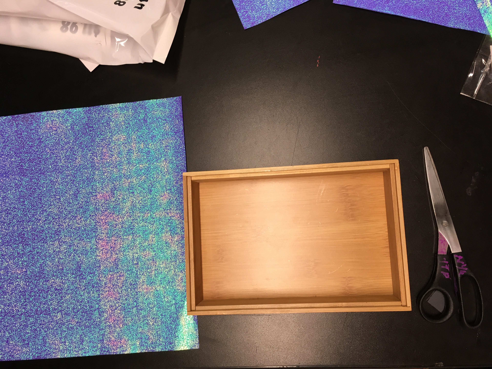
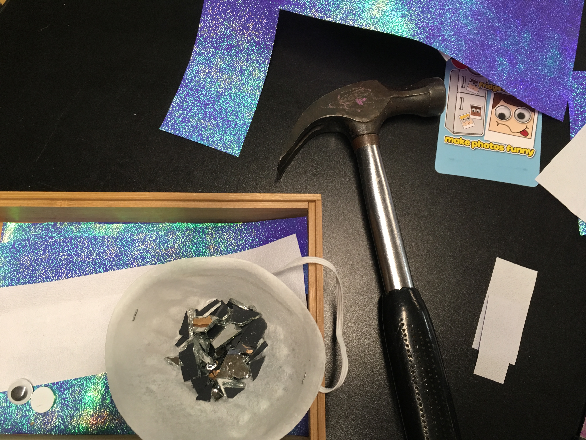

# Assignment: Reading response to *Completeness* (2011) by Itamar Moses.

## Fuch's questions for **Completeness**

### The world of the play

This place revolves around grad student's workplace, at university, and their homes, so it's just building interiors, man-made landscapes.

This play's timespan is a few weeks, with most scenes being conversations between individuals, which are then spread apart in time, or even at the same time.

The atmosphere is tense and dense because the characters mostly talk about their relationships, their feelings and super technical scientific issues. This play is heavy on dialogue.

### The social world of the play

This is a privileged world where people go to grad school to solve and study world-relevant issues. It is a very tiny subset of the world, not people with regular jobs or from underdeveloped countries, but rich societies where there is money and time to pursue a higher education and advance knowledge and science for the sake of the whole world.

People in this play, even though the focus is on their romantic interactions, are very isolated individuals, with little sense of community or collective, even though they share the same workplace and lifestyle.

### What changes?

The changes in this world are the romantic undertones and level of connection between the characters. Elliot falls for Molly. Elliot and Lauren break up. Molly stops seeing Don. Molly and Elliot stop seeing each other. Lauren and Don meet. Molly and Elliot get back together.

Something stable is Elliot's longing for connecting with someone. At the beginning he is in a relationship and still is interested in Molly when he first sees her.
At the end he is ready to throw away everything in his life as long as he can stay with her.

### Don't forget yourself

At first I thought that Elliot was a very unstable person, or careless with his interactions with other people, hurting them and not realizing it. By the end of the play I really appreciated his honesty, even if it led to hurtful conversations with other people, at least he was speaking the truth and not sugarcoating it.

This play also made me confirm that I prefer to talk more than to talk less, to be true to what I'm feeling, even if it just gut and not rational.

### Theatrical mirrors

This play echoes both romantic plays, where the main action revolves around people's romantic interests and all of the drama associated with it.

There is also some tragedy arc, where Elliot goes from being in a romantic relationship, to it failing, and then going through a journey where he transforms and realizes that his belief that he always falls out of love was wrong and he makes a brave act and decides to follow his romantic interest.

### The character fits the pattern

There is a great singularity in the way that novel concepts such as computer programming and molecular biology populate the play and become in certain scenes the main points of interest. The characters dive in very technical arguments, which can be hard to follow if you don't have a strong scientific background.

This play also goes from demanding a traditional setup, with no special effects, to having lines of programming code run through the walls and to break the fourth wall, after there is a sort of theatrical-computerized meltdown and restart.

## Sentences of the story

### One simple sentence

*Completeness* is a story about human couples.

### One complex sentence

*Completeness* is a story about what happens when you wanted to be involved with someone and then you don't want to anymore.

### Three to five sentence version of the story

*Completeness* is a story about being honest to your feelings, even if it leads to awkward conversations and breaking up with your special someone or doing unexpected unusual proposals of altering your life radically in order to be with someone you think you care about.

## Cornell Box that expresses your emotional response to *Completeness*

### Documentation

Box, paper, scissors:

Paper on box:

Mirrors on box:

Mirrors and eyes on box:

Smashed mirrors with hammer:

Smashed mirrors on box:

Final presentation:

